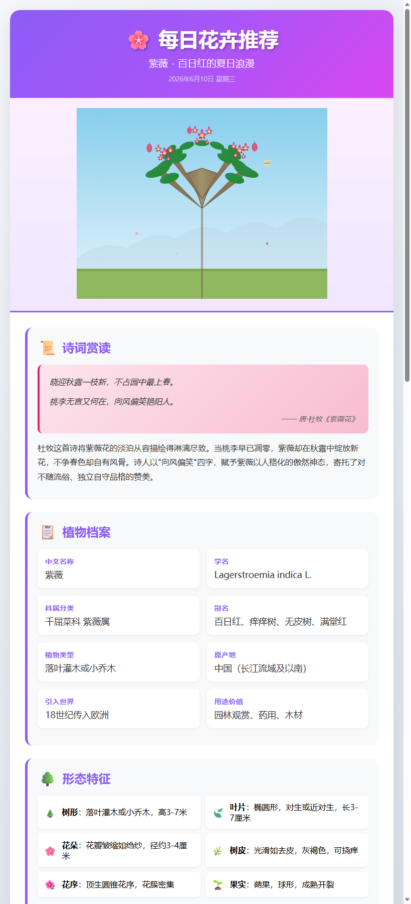

# 每日花卉推荐 Daily Flower Recommendation 🌸

一个**开箱即用的 Skill 模板**：让 AI 每天推荐一种花卉，生成**图文并茂的 HTML 专题页**——写实 SVG 插图、古诗词赏析、植物学对照、近亲植物对比、趣味知识、本地物候，一页读懂一朵花。

> 每日一花 · 认识身边的植物

---

## ✨ 特性

- 🌸 **每日一花**：自动推荐一种花卉，自动去重
- 🎨 **写实 SVG 插图**：野外可辨识，含比例尺和科学标注
- 📜 **诗词赏读**：真实古诗词 + 植物学对照表
- 📋 **植物档案**：学名、科属、花期、分布齐全
- 🌿 **近亲植物对比**：3 个近亲卡片 + 4 列对比表
- ✨ **趣味知识**：5-6 条文化趣闻
- 📍 **本地物候**：本地化观赏信息
- ⚙️ **可接入自动化**：配置为每日/每周定时任务自动执行

## 🖼️ 效果预览

<p align="center">
  
</p>

> 完整 HTML 示例见 [examples/](examples/)：

| 示例 | 花卉 | 推送日期 |
|------|------|----------|
| [2026-06-10](examples/2026-06-10-ziwei.html) | 紫薇 | 2026-06-10 |
| [2026-06-18](examples/2026-06-18-zimoli.html) | 紫茉莉 | 2026-06-18 |

## 📦 安装方法

### 方式一：直接把链接丢给 AI Agent（小白最推荐 🌟）

**什么都不用自己操作**，只需把下面这段话复制给你的 AI 助手（WorkBuddy / Codex / Claude 等），让它自己去下载、安装，再教你怎么用：

> 请帮我把这个 GitHub 仓库的 Skill 安装好：
> 仓库：https://github.com/fang-123559/daily-flower-recommendation
> 请先下载（git clone 或下载 ZIP），把 `daily-flower-recommendation` 文件夹放到我的 skills 目录
> （WorkBuddy: `~/.workbuddy/skills/`，Codex: `~/.codex/skills/`，Claude: `~/.claude/skills/`），
> 确认 `SKILL.md` 在文件夹根目录，然后告诉我怎么用它。

### 方式二：手动下载（推荐新手）

1. 点击右上角 **Code → Download ZIP** 下载并解压
2. 将解压后的文件夹放入你的 Skill 目录：
   - **WorkBuddy**：`~/.workbuddy/skills/`
   - **Codex**：`~/.codex/skills/`
   - **Claude**：`~/.claude/skills/`
   - 其他支持 Agent Skills 的平台：放入对应 skills 目录
3. 确保文件夹名为 `daily-flower-recommendation`，且 `SKILL.md` 在文件夹根目录

### 方式三：Git 克隆

```bash
git clone https://github.com/fang-123559/daily-flower-recommendation.git
# 然后将整个文件夹复制到 skills 目录
```

## 🚀 使用方式

### 方式一：对话中直接触发

> "每日花卉推荐"、"推荐一种花"、"今天认识什么花"

### 方式二：接入自动化定时推送（推荐）

在 WorkBuddy / Codex / Claude 等平台创建一个定时任务（每周二/四/日），prompt 可参考 [prompts/automation-prompt.md](prompts/automation-prompt.md)。

首次使用请复制 [templates/pushed-flowers-template.md](templates/pushed-flowers-template.md) 为项目根目录下的 `pushed_flowers.md`。

## 🗂️ 项目结构

```
daily-flower-recommendation/
├── SKILL.md                      # Skill 核心定义（执行流程 + 模块规范 + 异常处理）
├── README.md                     # 本文件
├── LICENSE                       # MIT 许可证
├── prompts/
│   └── automation-prompt.md      # 自动化定时任务的 prompt 模板
├── templates/
│   ├── flower-template.html      # HTML 专题页模板
│   └── pushed-flowers-template.md  # 已推送花卉记录模板（去重用）
└── examples/                     # 完整输出示例（HTML 专题页）
```

## ⚙️ 自定义

- **改配色**：修改模板中 CSS 变量的 4 个值（`--primary` 等）
- **改模块结构**：增删模板中的 section 区块
- **改触发场景**：修改 SKILL.md frontmatter 中的 `description` 触发词

## 📜 License

[MIT](LICENSE) © fang-123559

---

<p align="center"><b>每日一花 · 认识身边的植物</b> 🌸</p>
